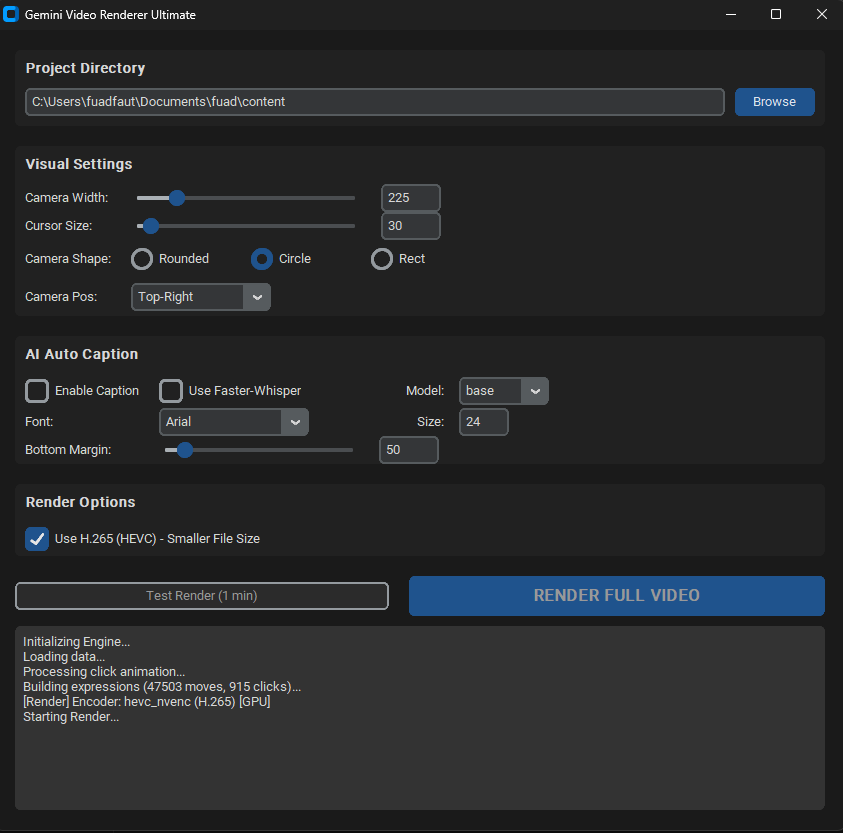

# Gemini Video Renderer Ultimate (Cap.so Alternative)

Tool rendering video berbasis FFmpeg yang dioptimalkan untuk memproses rekaman layar dari aplikasi **Cap.so desktop**. Menghasilkan video yang lebih smooth dan profesional dengan bantuan AI.



## 🚀 Fitur Utama
- **Smooth Cursor Interpolation**: Pergerakan kursor yang mengalir mulus menggunakan algoritma LERP.
- **Click Animation**: Simulasi visual efek klik (kursor mengecil saat diklik).
- **AI Auto Caption**: Transkripsi otomatis Bahasa Indonesia menggunakan **OpenAI Whisper** (Support GPU/Faster-Whisper).
- **Format Subtitle**: Menghasilkan Hardsub (.ass) dan Softsub (.srt).
- **Visual Customization**:
  - Ukuran Kamera & Kursor yang bisa diatur.
  - Pilihan Posisi Kamera (Pojok Kiri/Kanan/Tengah).
  - Bentuk Crop Kamera (Bulat/Kotak/Rounded).
- **Render Engine**:
  - Support **H.264 (AVC)** dan **H.265 (HEVC)**.
  - **Auto GPU Acceleration**: Otomatis mendeteksi NVIDIA NVENC.
  - **Smart Fallback**: Otomatis pindah ke CPU jika render GPU gagal.
- **Modern GUI**: Tampilan Dark Mode dengan fitur Auto-Save settings.

## 🛠️ Persyaratan Sistem
- **Python 3.10+**
- **FFmpeg**: Terinstal di sistem dan terdaftar di PATH.
- **NVIDIA GPU** (Opsional, tapi sangat disarankan untuk kecepatan).

## 📦 Instalasi
1. Clone repository ini.
2. Instal library yang dibutuhkan:
```powershell
# Core
pip install customtkinter openai-whisper

# Optional (Untuk performa maksimal)
pip install faster-whisper
```

## 📋 Cara Penggunaan
1. Jalankan aplikasi: `python main_gui.py`.
2. Pilih folder proyek yang berisi data rekaman Cap.so.
3. Atur konfigurasi visual (Ukuran, Posisi, dll).
4. Aktifkan **AI Caption** jika diinginkan (pilih Model `base` atau `small`).
5. Klik **RENDER FULL VIDEO**.

## 📂 Struktur Folder Input
```text
[Folder Proyek]/
├── cursors/             # Gambar kursor
├── segments/
│   └── segment-0/       # File rekaman mentah
│       ├── camera.mp4
│       ├── display.mp4
│       ├── audio-input.ogg
│       └── cursor.json  # Metadata
```

---
*Dibuat oleh Gemini CLI Agent.*
